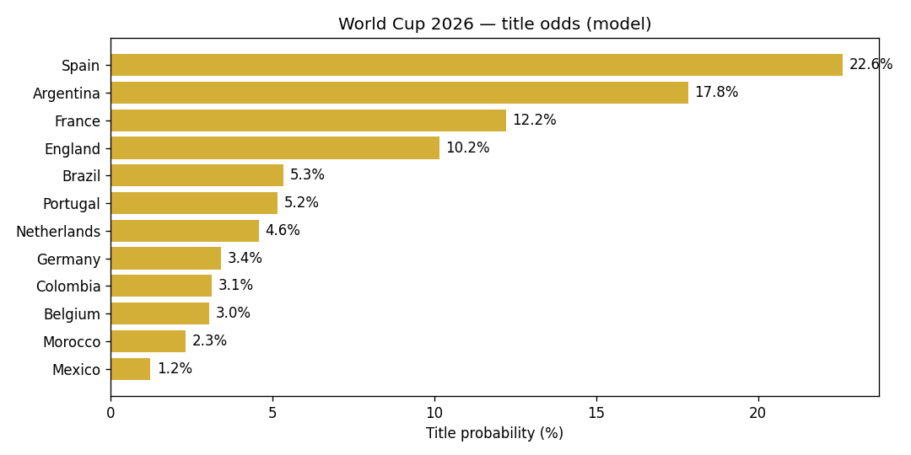

# 🏆 World Cup 2026 — Match & Champion Predictor

A self-contained machine-learning pipeline that rates every national team from
**154 years of international football**, learns a goal-scoring model with a
PyTorch neural network, folds in **current form** (June 2026 FIFA rankings and
EA FC 26 squad strength), and then runs a **10,000-run Monte-Carlo simulation**
of the official 48-team 2026 World Cup bracket to produce title odds for all 48
nations.

> **Current model favourites:** Spain ≈ 23%, Argentina ≈ 18%, France ≈ 12%,
> England ≈ 10% — broadly in line with the betting market.

<p align="center">
  
</p>

---

## Table of contents

1. [What this project does](#what-this-project-does)
2. [Results](#results)
3. [The data — where it comes from](#the-data--where-it-comes-from)
4. [Handling teams & names that "don't exist" in the data](#handling-teams--names-that-dont-exist-in-the-data)
5. [How the model works](#how-the-model-works)
6. [The blend: history + current form + players](#the-blend-history--current-form--players)
7. [Tournament simulation](#tournament-simulation)
8. [Project layout](#project-layout)
9. [How to run it](#how-to-run-it)
10. [Limitations & honest caveats](#limitations--honest-caveats)
11. [Credits & licence](#credits--licence)

---

## What this project does

The goal is simple to state and hard to do well: **predict the winner of the
2026 FIFA World Cup**, plus the probability that each team reaches every stage
(Round of 32 → Round of 16 → Quarter-final → Semi-final → Final → Champion).

The tournament has already kicked off, so the pipeline mixes **real results that
have already happened** (group matches already in the dataset are used as-is)
with **simulated results for everything still to be played**.

The whole approach is built on three independent signals, deliberately kept
separate so each can be reasoned about and tuned:

| Signal | Question it answers | Source |
| --- | --- | --- |
| **Elo rating** | How good has this team been, historically? | 49k-match history |
| **FIFA ranking** | How good is it considered *right now*? | FIFA, June 2026 |
| **Squad strength** | How good are the actual players available? | EA FC 26 ratings |

These get blended into a single pre-tournament team strength, which drives a
neural goal model, which drives the Monte-Carlo simulation.

---

## Results

Top of the board from the latest 10,000-simulation run
(`reports/title_probabilities.csv`):

| Team | Win % | Reach Final % | Reach Semi % | Advance from group % |
| --- | ---: | ---: | ---: | ---: |
| Spain | 22.6 | 32.9 | 46.0 | 98.5 |
| Argentina | 17.8 | 28.9 | 42.1 | 97.5 |
| France | 12.2 | 20.9 | 36.1 | 94.9 |
| England | 10.2 | 18.3 | 31.0 | 96.4 |
| Brazil | 5.4 | 11.1 | 22.7 | 93.7 |
| Portugal | 5.2 | 10.9 | 21.3 | 90.5 |
| Netherlands | 4.6 | 10.1 | 20.8 | 93.0 |
| Germany | 3.4 | 8.5 | 19.2 | 94.8 |

Per-match expected goals and win/draw/loss probabilities for every remaining
group fixture are in `reports/remaining_group_predictions.csv`. As a sanity
check the title odds line up closely with **bookmaker odds**
(`data/external/bookmaker_odds_2026.csv`), which we treat purely as an external
benchmark — never as a model input.

---

## The data — where it comes from

### 1. Historical match results (the backbone)

`data/raw/` holds the public **"International football results from 1872 to
2026"** dataset (originally compiled by Mart Jürisoo, widely mirrored on
Kaggle):

| File | Rows | What it is |
| --- | ---: | --- |
| `results.csv` | ~49,477 | Every international men's match: date, teams, score, tournament, venue, neutral flag. **This is the core training data.** |
| `shootouts.csv` | ~677 | Penalty-shootout outcomes for drawn knockout games. |
| `goalscorers.csv` | ~47,620 | Individual goal events (scorer, minute, penalty, own-goal). |
| `former_names.csv` | 36 | Maps historical country names to their modern equivalents. |

The dataset already includes the **2026 World Cup group matches that have been
played**, which the pipeline reads directly rather than simulating.

### 2. Current-form data (`data/external/`)

| File | What it is | Why it's external |
| --- | --- | --- |
| `fifa_rankings_2026.csv` | FIFA ranking points for all 48 finalists, June 2026 | A "live" view of current strength that pure history can't capture. |
| `eafc26_players_raw.csv` | ~18,400 individual player ratings from EA FC 26 (overall, value, position, nationality, …), sourced from the public **EAFC26-DataHub** | Lets us measure the quality of the *actual players* in each squad. |
| `squad_strength_2026.csv` | Derived per-team squad index (built by the code, see below) | Cached output of `build_squad_strength()`. |
| `bookmaker_odds_2026.csv` | Market title odds (~12 Jun 2026) | **Benchmark only** — used to validate the model, never to train it. |

---

## Handling teams & names that "don't exist" in the data

This is one of the trickiest parts of any long-horizon football model, and it
shows up in **three distinct ways**. We handle each one explicitly rather than
silently dropping teams.

### Problem 1 — Countries that changed their name

A team's results are scattered across history under names that no longer exist:
**Zaire** is today's *DR Congo*, **Czechia** appears as both *Czechia* and
*Czech Republic*, **Türkiye** vs *Turkey*, *Dahomey* → *Benin*, *Upper Volta* →
*Burkina Faso*, and so on.

If left alone, a single team's matches would be split across multiple identities
and its Elo would be wrong. We fix this in `normalize_teams()`:

- `former_names.csv` provides 36 official rename mappings (e.g. Zaire → DR Congo).
- A small hand-curated patch covers spellings the dataset still uses
  inconsistently: `Czechia → Czech Republic`, `Türkiye → Turkey`,
  `Zaire / Congo DR → DR Congo`.

After normalization, **all 48 finalists resolve to teams that exist in the
history** — so every team gets a real, history-based Elo rating. No World Cup
team starts from a blind guess.

### Problem 2 — Teams with sparse *player* data (the real "missing" case)

The historical record covers every nation, but the **EA FC 26 player dataset
does not**. Several finalists have very few rated players in it:

| Team | Rated players found | Total squad slots |
| --- | ---: | ---: |
| Jordan | 3 | 23 |
| Uzbekistan | 5 | 23 |
| Iran | 6 | 23 |
| Egypt | 10 | 23 |
| Haiti / Iraq | 14 | 23 |
| Curaçao / Panama | 15 | 23 |

Naively averaging "the 3 players we have" would make these squads look
artificially strong (only their best, most famous players appear in the game).
Our fix is **depth regularisation**, in `build_squad_strength()`:

```
squad_overall = ( sum(ratings of known players) + (23 − n) × 62 ) / 23
```

Every missing squad slot is filled at a **replacement level of 62** — roughly a
fringe-international standard. A team with only 3 rated stars is therefore
correctly penalised for lacking *depth*, instead of being flattered by a
small-sample average. The result is a fair, comparable squad index across all 48
teams regardless of how much player data exists.

### Problem 3 — A team missing from a current-strength table entirely

If a finalist were absent from the FIFA-ranking or squad-strength file, the
blend would break. To stay robust, any missing value is **imputed with the mean
of the other finalists** before blending (`np.nanmean` fallback in
`blend_external_into_elo`). In practice all 48 teams are present in both tables,
but the safety net means the pipeline never crashes or silently zeroes a team.

### Name-mapping for the player dataset

EA FC 26 uses its own country spellings, so a second mapping (`SQUAD_NAME_MAP`)
bridges our names to theirs: `South Korea → Korea Republic`,
`Ivory Coast → Côte d'Ivoire`, `Cape Verde → Cabo Verde`,
`Turkey → Türkiye`, `Czech Republic → Czechia`, etc. Without this, those squads
would have come back empty and been unfairly hammered by the depth penalty.

---

## How the model works

### Step 1 — Elo ratings from 154 years of results

We compute a **World-Football-style Elo** (`compute_elo`) by walking every match
in chronological order. Each match updates both teams' ratings by

```
Δ = K · tournament_weight · goal_multiplier · (actual − expected)
```

with the refinements that make football Elo realistic:

- **Home advantage** (`hfa = 65`) added to the home side's rating, but only for
  non-neutral venues.
- **Margin of victory** scaling (`goal_multiplier`): a 3-goal win moves the
  ratings more than a 1-goal win.
- **Match importance** (`tournament_weight`): a World Cup match counts for
  1.00, a friendly only 0.30, with qualifiers and continental tournaments in
  between. Friendlies barely move the needle; finals move it a lot.

Crucially, ratings are recorded **pre-match**, so they can be used as honest
features without leaking the result they're trying to predict.

### Step 2 — Features

For every match we build (`build_features`):

- `elo_diff` — pre-match Elo gap (with home advantage folded in),
- `neutral` — neutral-venue flag,
- `importance` — the tournament weight,
- **rolling form** over each team's last 10 matches: goals for, goals against,
  and points-per-game, all computed *pre-match* to avoid leakage.

### Step 3 — A two-headed Poisson neural network

`WCModel` (PyTorch) is a small shared-trunk network with **two output heads**:
expected goals for the home side and for the away side. Goals are count data, so
we train with **Poisson negative-log-likelihood loss** (`PoissonNLLLoss`) rather
than plain regression — the natural choice for "how many goals" problems.

Training (`train_model`) uses two weighting tricks so the model learns from the
*relevant* football:

- **Recency weighting** — an 8-year half-life, so a 2024 match counts far more
  than a 1990 one.
- **Importance weighting** — competitive matches outweigh friendlies.

We use a chronological train/validation split (no shuffling across time) and
reach roughly **60% match-outcome accuracy** on held-out recent matches — strong
for three-way (win/draw/loss) football prediction.

---

## The blend: history + current form + players

A team's history (Elo) tells you what it *was*; it can lag a rising or declining
squad. So before simulating, `blend_external_into_elo()` nudges each finalist's
Elo toward two current-day signals, combined in **z-score space** so the three
scales are comparable:

```
z_blend = 0.60 · z(Elo) + 0.20 · z(FIFA points) + 0.20 · z(squad strength)
```

then mapped back onto the Elo scale. So **60% of pre-tournament strength stays
with the results-based history**, 20% comes from the current FIFA ranking, and
20% from EA FC 26 squad quality. The weights (`alpha_fifa`, `alpha_squad`) are
single knobs you can tune in `run_pipeline`.

> **Why players only affect the blend, not the model:** the network is a
> *team-level* model — there are no historical per-match lineups in the data, so
> player ratings can't be training features. They influence the *current
> strength* of each squad only. Swap in a different player CSV (injuries, new
> call-ups, retirements) and the squad index — and therefore the predictions —
> changes accordingly.

---

## Tournament simulation

`simulate_tournament` runs the event **10,000 times** with a seeded NumPy RNG.
Each run (`simulate_once`):

1. **Group stage** — plays all 12 official groups. Matches already played in
   real life use their **real scores**; the rest are sampled from the model's
   Poisson goal expectations. Standings use the real FIFA tiebreakers (points,
   then goal difference, then goals scored).
2. **Best third-placed teams** — the 8 best third-place finishers advance, and
   are matched to bracket slots using the **official position-constrained
   assignment** (with a backtracking solver to honour the "third from group
   A/B/C…" rules, exactly as FIFA does it).
3. **Knockouts** — the full official Round-of-32 → Final bracket
   (`R32`, `R16`, `QF`, `SF`, `FINAL`). Each tie samples Poisson goals; **draws
   go to a shootout** decided with a slight edge to the stronger team.

Across all 10,000 runs we tally how often each team reaches each stage and wins
the title, then write the table to `reports/title_probabilities.csv` and the
chart to `reports/title_odds.png`.

---

## Project layout

```
world cup project/
├── data/
│   ├── raw/                       # historical match dataset (results, shootouts, goalscorers, former_names)
│   └── external/                  # FIFA rankings, EA FC 26 players, squad strength, bookmaker odds
├── src/
│   ├── worldcup.py                # the entire pipeline (data → Elo → model → blend → simulation)
│   └── _build_nb.py               # regenerates the narrative notebook from the source
├── notebooks/
│   └── world_cup_2026_prediction.ipynb   # readable, narrative walk-through
└── reports/
    ├── title_probabilities.csv    # per-team odds for every stage
    ├── remaining_group_predictions.csv   # xG + W/D/L for each remaining group match
    └── title_odds.png             # title-probability chart
```

All heavy logic lives in `src/worldcup.py` so it can be unit-tested from the
shell and imported by the notebook as a thin narrative layer.

---

## How to run it

**Requirements:** Python 3.10+ (developed on 3.14), with:

```bash
pip install numpy pandas torch matplotlib nbformat
```

> Note: TensorFlow is intentionally **not** used (it has no Python 3.14 build) —
> the model is pure PyTorch.

**Run the full pipeline** (loads data, trains, blends, simulates, prints the
title board):

```bash
python src/worldcup.py
```

**Use it from Python / a notebook:**

```python
import sys; sys.path.insert(0, "src")
import worldcup as w

out = w.run_pipeline(n_sims=10000, epochs=60)
print(out["sim"].head(12))      # title probabilities
```

**Regenerate the narrative notebook:**

```bash
python src/_build_nb.py
```

> On a Windows console with a non-UTF-8 codepage (e.g. cp1256), set
> `PYTHONIOENCODING=utf-8` before running to avoid Unicode errors on team names
> like *Curaçao* or *Côte d'Ivoire*.

---

## Limitations & honest caveats

- **Team-level, not lineup-level.** With no historical lineups in the data, the
  model can't know who's actually injured or starting. Squad strength is a
  proxy, refreshed only by the EA FC 26 ratings file.
- **EA ratings are a snapshot.** They reflect EA's view at game launch, not
  live June-2026 form, and they under-cover smaller nations (hence the depth
  regularisation above).
- **Independent-Poisson scores.** Home and away goals are modelled
  independently; real matches have some score correlation we don't capture.
- **`goalscorers.csv` / `shootouts.csv`** ship with the dataset and are
  documented here for completeness, but the current model does not use
  individual goal events or historical shootout records as features — they're an
  obvious avenue for future work.
- **Bookmaker odds are a yardstick, not an input** — they're only used to sanity
  check the output.

---

## Credits & licence

- **Historical results** — *International football results from 1872 to 2026*,
  compiled by Mart Jürisoo (public dataset, widely mirrored on Kaggle).
- **Player ratings** — EA FC 26, via the public **EAFC26-DataHub** project.
- **FIFA rankings & market odds** — FIFA (June 2026) and public market
  consensus, collected for benchmarking.

This repository is provided for educational and research purposes. Please
respect the original licences of the upstream datasets.
```
